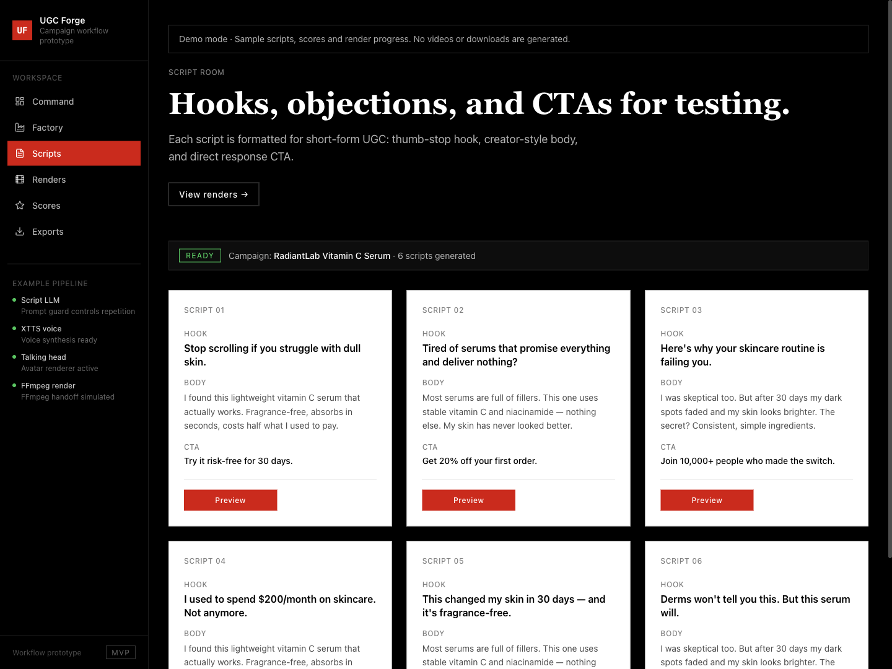
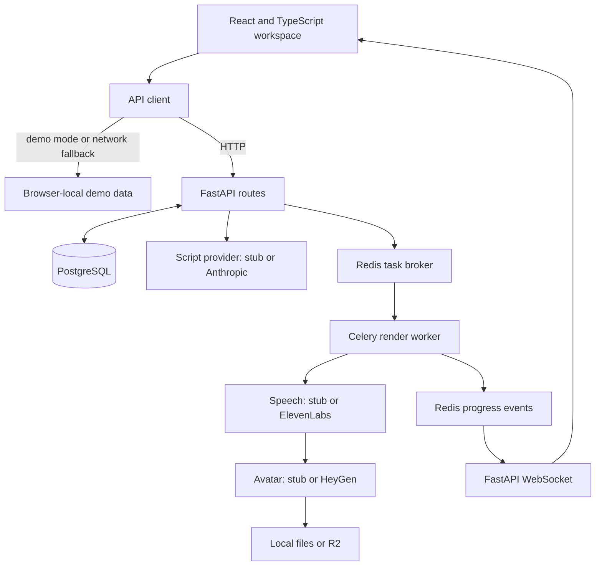

# UGC Forge

A campaign-to-video workflow prototype with a React workspace, FastAPI backend, and replaceable script, speech, and avatar providers.

UGC Forge organizes a product brief into campaigns, script variants, queued renders, and exports. It is useful both as an interactive portfolio demo and as a starting point for studying asynchronous content-production pipelines.

**Status:** prototype. The browser demo uses simulated data; the backend defaults to stub providers. Generated scores are not validated predictions of advertising performance.



*Actual local browser demo. Scripts, progress, scores and render URLs are simulated; this image does not show generated video.*

[Quick start](#quick-start) · [Architecture](#architecture) · [Backend setup](#backend-setup) · [Development](#development)

## What is included

- Campaign briefs with audience, product claims, tone, and voice settings.
- Script and render views, export controls, and a campaign overview.
- A browser-local demo that runs without credentials or backend infrastructure.
- Backend campaign persistence, script generation, and Celery render tasks.
- Provider adapters for Anthropic, ElevenLabs, and HeyGen, plus local or R2 storage.

## Quick start

Run the browser demo first:

```bash
git clone https://github.com/anudeepadi/ugc-forge.git
cd ugc-forge
npm ci
VITE_DEMO_MODE=true npm run dev
```

Open [localhost:3000](http://localhost:3000). Demo campaigns and progress are simulated in browser memory and reset on reload; they do not invoke paid providers or publish advertisements.

## Try the workflow

1. Start in **Command** to inspect the seeded example campaign.
2. Open **Factory**, enter a product name and description, then select **Generate campaign**.
3. Inspect the six sample variants in **Scripts** and the simulated queue in **Renders**.
4. Reload the page to return to the seed data. Browser changes are not persisted.

The browser demo does not generate playable videos or downloadable export archives. The script templates remain the same skincare sample regardless of the product entered. Scores are random sample values, render links are placeholders, and export completion states are UI demonstrations. With a running backend, the CSV route can export script metadata; ZIP/JSON packaging is not implemented by the frontend.

## Architecture



The frontend and backend can run independently. The API client falls back to demo data on network failures, so a populated UI alone does not prove the backend is connected. The current WebSocket client uses a hard-coded localhost URL.

## Backend setup

Requires Docker Compose. The Compose stack supplies PostgreSQL, Redis, the API, and a worker, using Python 3.12 containers.

```bash
cd backend
cp .env.example .env
docker compose up -d --build
docker compose exec api alembic upgrade head
```

Apply the migration before creating campaigns. Keep the default `stub` provider settings for local exploration. API documentation is at [localhost:8000/docs](http://localhost:8000/docs).

In another terminal, from the repository root:

```bash
VITE_DEMO_MODE=false VITE_API_URL=http://localhost:8000/api/v1 npm run dev
```

### Configuration

| Setting | Purpose |
| --- | --- |
| `VITE_DEMO_MODE` | Force the browser demo when `true` |
| `VITE_API_URL` | HTTP API base URL |
| `DATABASE_URL`, `REDIS_URL` | Backend persistence and queue connections |
| `SCRIPT_PROVIDER` | `stub` or `anthropic` |
| `TTS_PROVIDER` | `stub` or `elevenlabs` |
| `AVATAR_PROVIDER` | `stub` or `heygen` |
| `STORAGE_BACKEND` | `local` or `r2` |

Provider credentials belong only in the backend environment. See [backend/.env.example](backend/.env.example) for key names. Selecting live providers can create billable requests.

## Code guide

| Path | Responsibility |
| --- | --- |
| [src/pages/](src/pages/) | Campaign, script, render, scoring, and export screens |
| [src/lib/api.ts](src/lib/api.ts) | API requests and demo fallback |
| [src/lib/demo-api.ts](src/lib/demo-api.ts) | Simulated browser workflow |
| [backend/app/api/](backend/app/api/) | HTTP and WebSocket routes |
| [backend/app/providers/](backend/app/providers/) | Replaceable generation adapters |
| [backend/app/workers/pipeline.py](backend/app/workers/pipeline.py) | Speech, avatar, storage, and progress stages |
| [backend/alembic/](backend/alembic/) | Database migrations |

## Verification

The frontend production build and the local campaign → six scripts → render-queue walkthrough were checked on 22 September 2026 with Node.js 26.9.0. This is a check of the browser demo; paid providers and the Docker backend were not exercised in that pass.

## Development

```bash
npm run build
```

The frontend declares Vitest commands, but no frontend test files are currently tracked. Backend tests are in [backend/tests/](backend/tests/); install `backend/requirements-dev.txt` as well as runtime dependencies. Database tests require a separate `ugcforge_test` database and create/drop its tables. See [conftest.py](backend/tests/conftest.py) before running them.

Known prototype boundaries include public-backend authentication, deployment-specific WebSocket configuration, and verifying durable render status alongside progress events. Meta Ads environment placeholders do not establish a working distribution integration. Live provider delivery is separate from the stub workflow.

Contributions should state whether they affect demo behavior, backend behavior, or both, and include a reproduction for the relevant mode.

## License

[package.json](package.json) declares ISC. A standalone license file is not currently tracked; repository-wide redistribution terms should be clarified before a formal open-source release.
